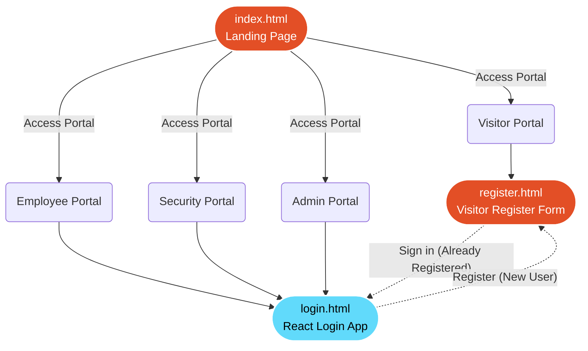
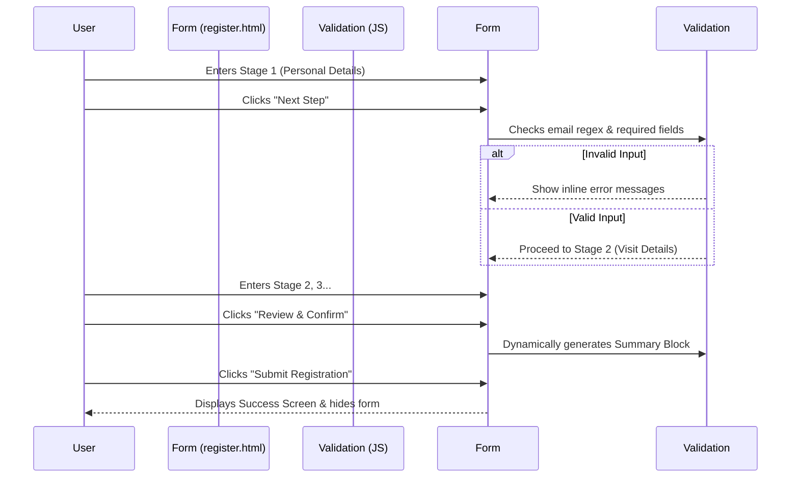

# Visitor Management System (VMS) Portal

Welcome to the Visitor Management System (VMS) front-end portal! This project is a hybrid application featuring a combination of lightweight Vanilla JS for rapid user interaction and a modern React architecture for robust state-managed components (like the Login page).

## 📊 User Flow & Architecture

The following flowchart illustrates the navigation paths and technologies used across the application:



### 📋 Visitor Registration Flow (Multi-Step Form)

The Visitor Registration form utilizes Vanilla JavaScript to create a seamless, single-page multi-step experience without reloading the browser.



## 🛠️ Technology Stack

This project was built intentionally without complex build tools (like Webpack or Vite) to ensure it can be dropped into any environment easily.

- **HTML5 & CSS3**: Structured layout and responsive grids.
- **Vanilla JavaScript**: Handles multi-step form navigation, DOM manipulation (cloning company rows), and real-time form validation.
- **React (via CDN)**: The `login.html` page mounts a React application (`login.jsx`) compiled directly in the browser via Babel Standalone, leveraging `useState` to manage login errors, loading states, and mock authentication logic.

## 📁 Directory Structure

```text
/vms
├── index.html           # Landing page with Portal Selector
├── register.html        # Multi-step visitor registration form
├── login.html           # Authentication page
├── README.md            # You are here!
├── css/
│   ├── landing.css      # Styles specific to the landing grid
│   ├── register.css     # Styles for the multi-step form & dynamic rows
│   └── login.css        # Styles for the React login component
└── js/
    ├── register.js      # Vanilla JS for form validation and stage toggling
    └── login.jsx        # React Component (uses Babel to compile)
```

## 🚀 How to Run

Because this project relies on vanilla web standards and CDN scripts, **no installation or build step is required!**

1. Simply open the folder on your computer.
2. Double-click `index.html` to open it in your default web browser.
3. Everything is client-side, so you can navigate, fill forms, and test validations entirely offline.
